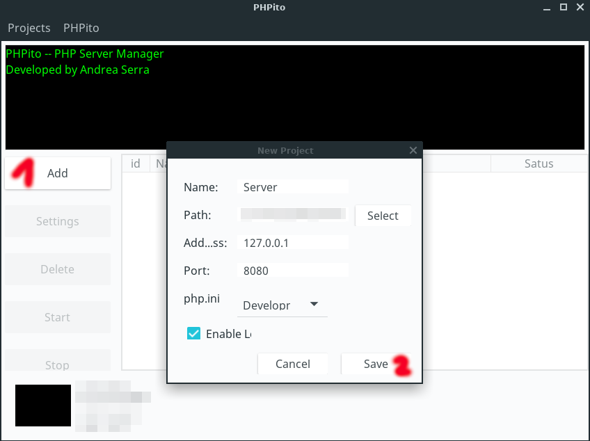

# Portable-PHP-Server

## This program supports multiple PHP servers (always with different ports)

## Run PHPito.jar

## We put the parameters we want, it does not have to be the same as in the image

## We create a file to check the server operation

